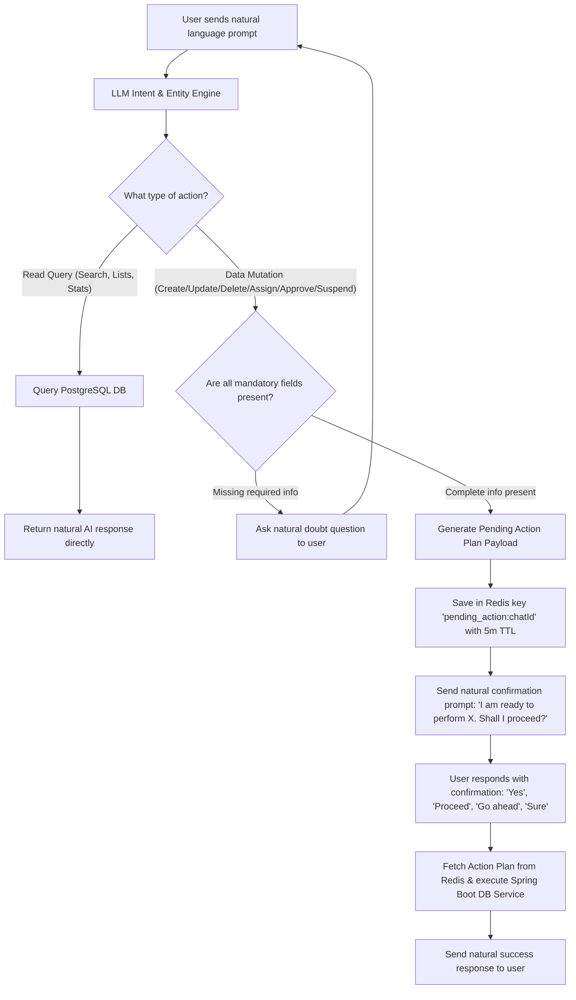

# AgentCraft / FlowZint — Master System Correction & Universal AI Chatbot Prompt

> **Instructions for AI Coding Assistant / Developer:**
> This prompt contains the comprehensive specifications to overhaul and complete the **AgentCraft (FlowZint)** project. Execute all changes across the Spring Boot backend (`backend/`), React frontend (`Frontend/`), Telegram Chat Bot FSM (`ConversationFsm.java`), and startup scripts.

---

## 📋 EXECUTIVE SUMMARY & MASTER OBJECTIVES

1. **Universal Freeform AI Chat Experience (Gemini / Claude Style):**
   - Eliminate all primitive string splitting (`split(" ")`), hardcoded regex matchers (`startsWith(...)`), and rigid canned template responses (`"Invite +1XXXXXXXXXX as Employee"`).
   - Except for initial registration and verification (which retain necessary step-by-step setup), ALL chat interactions across **100% of Portal Domains** (Tasks, Employees, Departments, Roles, Analytics, Settings) must be driven by an LLM Natural Language & Entity Extraction Engine.
2. **Universal Pre-Execution Confirmation Step ("Ask Once Before Doing"):**
   - For **ANY data-modifying action** (Create, Update, Delete, Reassign, Approve, Reject, Suspend, Invite, Modify Settings), the AI MUST summarize the decoded actions in natural language and **ask ONCE for user confirmation** before calling the database.
   - Read-only queries (search, lists, stats, reports) execute immediately and respond naturally without asking for confirmation.
3. **Interactive AI Doubt & Clarification Engine:**
   - When user prompts lack mandatory fields required by backend APIs, the AI must ask clarifying questions to gather the missing details before proposing the action.
4. **Bot Session Control (`/exit` & `/end` Commands):**
   - Add explicit `/exit` and `/end` command interceptors to flush active Redis session context, set state to idle, and stop processing until `/start`.
5. **100% Functional Web Portal:**
   - Audit, fix, and wire every button, form, filter, tab, modal, and action in `Frontend/src/main.jsx` to live Spring Boot REST API endpoints.
6. **One-Click Server Launchers (`.bat` files):**
   - Provide `run_backend.bat` and `run_frontend.bat` scripts in `AgentCraft/` with automated Docker checks, environment variable exports, and error pausing.

---

## 🌐 REQUIREMENT 1: UNIVERSAL PORTAL ACTION COVERAGE & AI ARCHITECTURE

The AI Agent must handle natural language requests for **all** of the following portal capabilities:

### 1. 📋 Task Management Domain
- **Create Task(s) (Single or Bulk):** `"Create a task for audit and assign to Rahul"` / `"Create 3 tasks: ..."`
- **Assign / Reassign Task:** `"Reassign task #4 to Jessica"` / `"Assign all pending QA tasks to Alex"`
- **Update Task Status:** `"Mark inventory audit as completed"` / `"Move frontend redesign to In Progress"`
- **Approve / Reject Task:** `"Approve task #12"` / `"Reject task #15 because of missing docs"`
- **Task Priority & Deadline:** `"Set task #8 priority to HIGH and deadline to Friday EOD"`
- **Task Search & Filter (Read Query):** `"Show all overdue tasks in UI/UX department"`

### 2. 👥 Employee & Team Management Domain
- **Invite Employee(s) (Single or Bulk):** `"Add 3 employees: 1. AARYA (Backend Dev, devs) 2. ANUSHKA (Designer, UI/UX) 3. Akshay (Team Leader, Management)"`
- **Role Assignment & Changes:** `"Change Jessica's role from Developer to Lead"`
- **Department Assignment & Transfers:** `"Move Rahul from Sales to Marketing department"`
- **User Suspension & Activation:** `"Suspend user John due to leave"` / `"Reactivate user Sarah"`
- **Employee Search & Directory (Read Query):** `"Who is in the Engineering team?"`

### 3. 🏢 Department & Role Domain
- **Create Department:** `"Create a new department called Quality Assurance"`
- **Modify / Rename Department:** `"Rename Sales department to Enterprise Growth"`
- **Create Custom Role:** `"Create a new role called Senior Auditor with task creation permissions"`
- **Assign Department Head:** `"Set Akshay as the head of Management department"`

### 4. 📊 Analytics, Metrics & Reports Domain (Read-Only)
- **KPI & Performance Summaries:** `"Show me this week's task completion rate"`
- **Missed Deadlines & Bottlenecks:** `"Which department has the most overdue tasks?"`
- **Generate / Export Reports:** `"Export monthly performance report for Sales"`

### 5. ⚙️ Business Settings & Portal Identity Domain
- **Business Profile Updates:** `"Update business name to ContextCraft AI"`
- **Working Hours & Timezones:** `"Set working hours from 9 AM to 6 PM EST"`

---

## 🔄 REQUIREMENT 2: CONFIRMATION & EXECUTION WORKFLOW



### Confirmation Response Requirements:
- Format proposed actions in clear, bulleted Markdown.
- Explicitly prompt: *"Would you like me to proceed with applying these changes to your portal?"*
- Support natural affirmative responses: `"yes"`, `"yeah"`, `"confirm"`, `"do it"`, `"go ahead"`, `"sure"`, `"proceed"`, `"ok"`, `"approved"`.

---

## 🛑 REQUIREMENT 3: `/exit` & `/end` TELEGRAM BOT COMMANDS

1. **Triggers:** `/exit`, `/end` (Case-insensitive).
2. **Behavior:**
   - Intercept command in `TelegramWebhookController` / `ConversationFsm`.
   - Flush active Redis session context (`conversation_state:<chat_id>` and `pending_action:<chat_id>`).
   - Transition state to `SESSION_ENDED` / idle.
   - Send farewell notification:
     > *"🔒 **Session Ended.** Your AI Business Bot is now idle. Send `/start` at any time to resume your session."*

---

## 🚀 REQUIREMENT 4: DOUBLE-CLICKABLE LAUNCHERS (`.bat`)

Place these scripts in the `AgentCraft/` root directory:

### `run_backend.bat`
```cmd
@echo off
TITLE AgentCraft - Backend Server Runner
COLOR 0A
echo ===================================================
echo   Starting AgentCraft Spring Boot Backend Server
echo ===================================================
echo.

echo [1/3] Checking & Starting Docker Containers (Postgres & Redis)...
docker-compose up -d

echo [2/3] Configuring Environment Variables...
set TELEGRAM_BOT_TOKEN=8841120098:AAFqvWqxNTRQPQ8J2jp4pZECAs0288YWxNk
set TELEGRAM_WEBHOOK_SECRET=c2c77d61b365ff349a60e0a54e9bc36d
set SPRING_PROFILES_ACTIVE=dev

echo [3/3] Launching Spring Boot Application...
cd backend
call .\mvnw.cmd spring-boot:run

if %ERRORLEVEL% NEQ 0 (
    echo.
    echo [ERROR] Backend Server crashed or failed to start.
)
pause
```

### `run_frontend.bat`
```cmd
@echo off
TITLE AgentCraft - Frontend Server Runner
COLOR 0B
echo ===================================================
echo   Starting AgentCraft React Frontend (Vite)
echo ===================================================
echo.

cd Frontend

if not exist "node_modules\" (
    echo [1/2] Installing npm dependencies...
    call npm install
)

echo [2/2] Starting Vite Dev Server...
call npm run dev

if %ERRORLEVEL% NEQ 0 (
    echo.
    echo [ERROR] Frontend Dev Server failed to start.
)
pause
```

---

## 🌐 REQUIREMENT 5: 100% FUNCTIONAL WEBSITE PORTAL INTEGRATION

Wire every component in `Frontend/src/main.jsx` to live backend endpoints:

| Component / Tab | UI Elements | Live Endpoint Wiring |
|---|---|---|
| **Overview Dashboard** | Stat Cards, Recent Activity | `GET /api/v1/analytics/summary`, `GET /api/v1/tasks/recent` |
| **Analytics View** | Performance Charts, Date Filters, Export Report | `GET /api/v1/analytics`, `GET /api/v1/analytics/export` |
| **Task Management** | Create Task Modal, Status Filters (Pending, In Progress, Completed), Approve/Reject/Reassign Buttons | `GET /api/v1/tasks`, `POST /api/v1/tasks`, `PUT /api/v1/tasks/{id}/status`, `POST /api/v1/tasks/{id}/approve` |
| **Employee Directory** | Invite Employee Modal, Role Dropdowns, Department Filters, Suspend/Activate Toggles | `GET /api/v1/users`, `POST /api/v1/users/invite`, `PUT /api/v1/users/{id}/role`, `PUT /api/v1/users/{id}/status` |
| **Departments & Roles**| Add Department Modal, Add Role Modal, Permission Toggles | `GET /api/v1/departments`, `POST /api/v1/departments`, `GET /api/v1/roles`, `POST /api/v1/roles` |
| **Profile & Settings** | Save Profile Form, Webhook Indicator | `GET /api/v1/users/me`, `PUT /api/v1/users/me`, `GET /api/v1/telegram/status` |

---

## 🎯 DEFINITION OF DONE
- [ ] Primitive `split(" ")` / regex string matchers completely purged from backend chat router.
- [ ] 100% of Portal actions covered by natural language intent parser.
- [ ] Pre-execution confirmation step ("Ask once before doing") active for all data-modifying actions.
- [ ] Read-only queries execute immediately with natural AI responses.
- [ ] `/exit` and `/end` commands flush Redis state and stop processing.
- [ ] `run_backend.bat` and `run_frontend.bat` scripts functioning.
- [ ] Web portal components connected to backend REST APIs.
